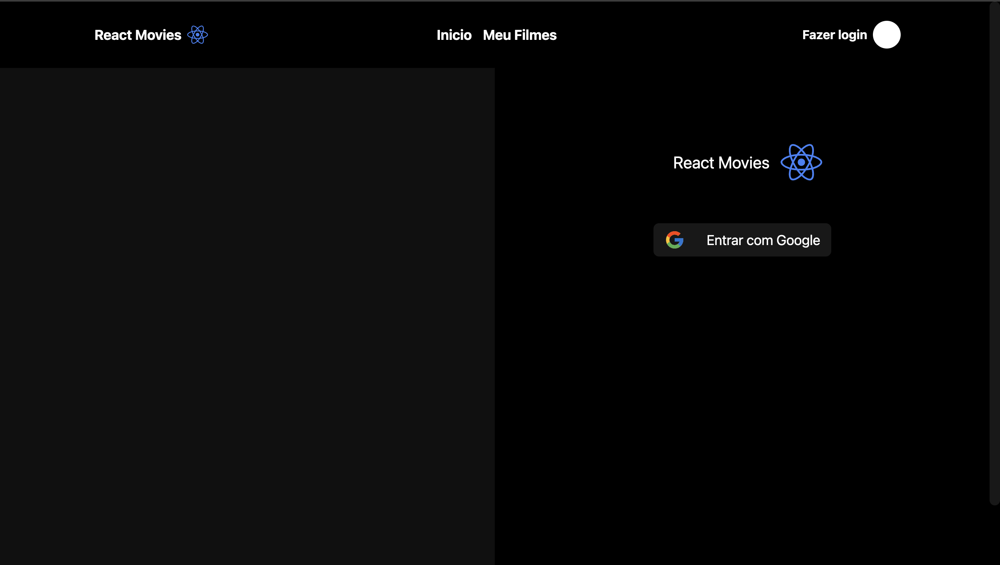
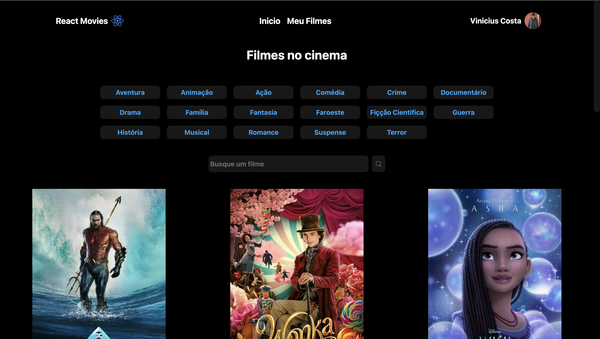
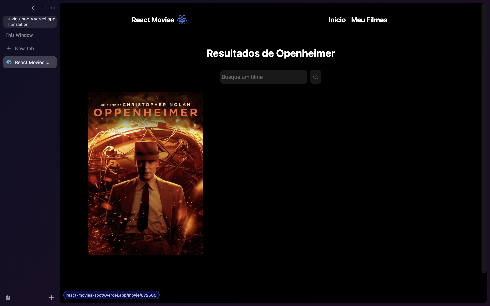

# 📸 Overview:






# 💻 Project:

## Aplicação capaz de realizar autenticação via Google, exibir filmes em cartaz no cinema, adicionar na lista de favoritos e obter informações relevantes como sinopse e elenco do filme

### Application be able of authenticating via Google, showing films currently showing at the cinema, adding them to the favorites list and obtaining relevant information such as the synopsis and cast of the movie.

# 🚀 Technologies:

### ✔️ Fastify

### ✔️ NodeJS

### ✔️ Prisma

### ✔️ Typescript

### ✔️ Axios

### ✔️ React hook Form

### ✔️ Zod

### ✔️ NextJS

### ✔️ TailwindCSS

# How to run

```
# Clone this repository
$ git clone https://github.com/vinnycosta9898/react-movies

# Go to the directory
$ cd react-movies

# Install Dependencies
$ npm install
$ yarn dev
$ pnpm install

# Run Web Server
$ npm run dev
$ yarn dev
$ pnpm run dev
```
