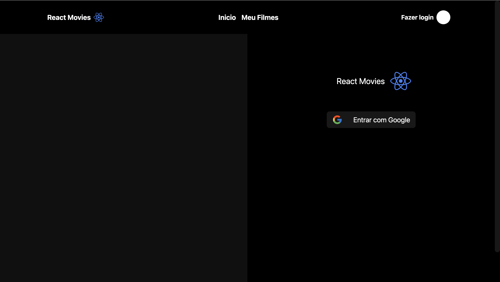

# React Movies

# 📸 Overview:


# 💻 Project:
## Aplicação Frontend que exibe os filmes que estão em cartaz no cinema utilizando a API do TheMovieDB

# 🚀 Technologies:
### ✔️ Axios
### ✔️ ReactJS 
### ✔️ TypeScript
### ✔️ Styled-Components
### ✔️ Vite

# How to run

```
# Clone this repository
$ git clone https://github.com/vinnycosta9898/react-movies

# Go to the directory
$ cd react-movies

# Install Dependencies
$ npm i

# Run Web Server
$ npm run dev